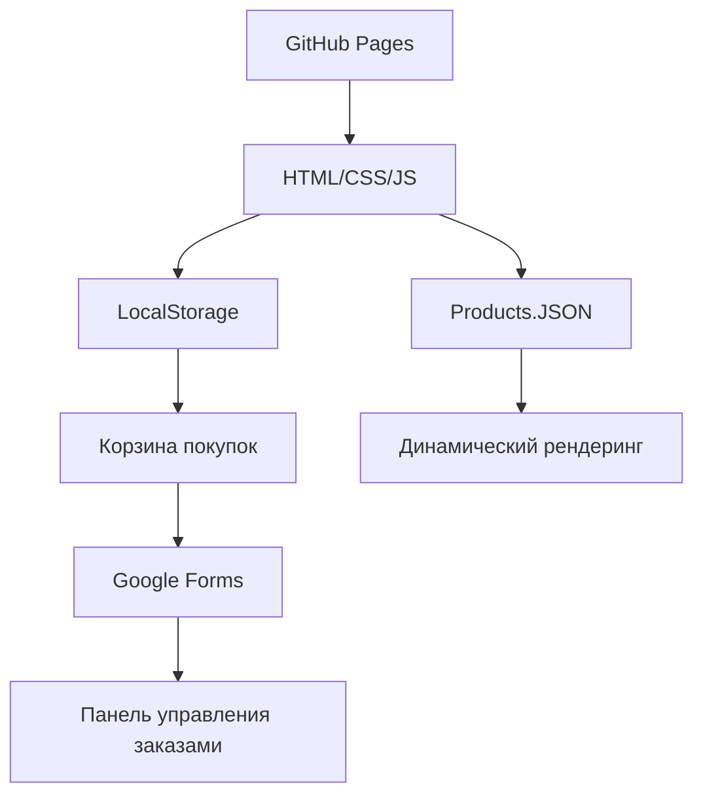

# Lazy Shop Framework

Особенности:
- Никаких файлов в репозитории - все фото по ссылкам. Превью товаро можно залить сюда: https://postimages.org/
- Отправка заказа из корзины в телеграмм бота


**Минималистичный фреймворк для создания интернет-магазинов на GitHub Pages**

## 🎯 Философия

Lazy Shop — это подход "ленивого разработчика": максимум результата при минимуме усилий. Мы верим, что создание интернет-магазина должно быть простым, быстрым и бесплатным.

> **"Лень — двигатель прогресса"** — мы автоматизируем рутину, чтобы вы могли сосредоточиться на самом важном: вашем бизнесе.

## ✨ Ключевые особенности

### 🚀 Нулевая стоимость
- **Бесплатный хостинг** на GitHub Pages
- **Никаких серверов** — полностью статический сайт
- **Отсутствие абонентской платы** — платите только за домен (если нужен)

### ⚡ Простота использования
- **Редактирование в одном файле** — весь каталог в `data/products.json`
- **Без программирования** — достаточно базового знания Excel/JSON
- **Интуитивное управление** — добавляйте товары как в таблице

### 🛡️ Надежность
- **Статические файлы** — нечего взламывать
- **Автоматическое резервное копирование** через Git
- **Высокая производительность** — мгновенная загрузка страниц

### 📱 Современные технологии
- **Адаптивный дизайн** — работает на всех устройствах
- **PWA-готовность** — можно установить как приложение
- **Быстрый поиск и фильтрация** на клиентской стороне

## 🏗️ Архитектура

### Технологический стек


### Структура данных
```json
{
  "id": 1,
  "name": "Название товара",
  "price": 10000,
  "images": ["url1.jpg", "url2.jpg"],
  "specs": {
    "width": 225,
    "height": 65,
    "diameter": 17
  }
}
```

## 🎨 Возможности кастомизации

### Темы оформления
- **Готовые CSS-темы** — быстрое изменение внешнего вида
- **Модульная структура** — легко修改 отдельные компоненты
- **CSS-переменные** — настройка цветов без редактирования кода

### Функциональность
- **Система фильтров** — по категориям, цене, брендам
- **Поиск товаров** — мгновенный поиск по названиям
- **Корзина покупок** — с сохранением в localStorage
- **Хлебные крошки** — удобная навигация
- **SEO-оптимизация** — готовые мета-теги и структура

## 📦 Что входит в комплект

### Базовые страницы
- 🏠 **Главная страница** — каталог товаров с фильтрами
- 📋 **Страница товара** — детальное описание и галерея
- 🛒 **Корзина** — управление заказом
- 📝 **Оформление заказа** — форма сбора данных
- ✅ **Подтверждение** — страница успешного заказа

### Инструменты разработчика
- 🛠️ **Конвертер Excel to JSON** — для импорта товаров
- 📊 **Генератор sitemap.xml** — для SEO
- 🤖 **Базовый robots.txt** — управление индексацией
- 📱 **PWA манифест** — для мобильных устройств

## 🚀 Быстрый старт

### 1. Клонируйте репозиторий
```bash
git clone https://github.com/yourname/lazy-shop.git
```

### 2. Настройте товары
Отредактируйте `data/products.json` под ваш каталог

### 3. Загрузите на GitHub
```bash
git add .
git commit -m "Мой первый магазин"
git push
```

### 4. Активируйте GitHub Pages
В настройках репозитория → Pages → branch: main

### 5. Profit!
Ваш магазин доступен по адресу `https://yourname.github.io/lazy-shop`

## 🛒 Система заказов

### Вариант 1: Google Forms (Рекомендуется)
- ✅ Полностью бесплатно
- ✅ Автоматическая таблица заказов
- ✅ Уведомления на email
- ✅ Простая настройка

### Вариант 2: Formspree/Getform
- ✅ REST API интеграция
- ✅ Валидация данных
- ✅ Спам-фильтры
- ✅ Бесплатный тариф

### Вариант 3: Telegram бот
- ✅ Мгновенные уведомления
- ✅ Удобство мобильного управления
- ✅ Простая реализация

## 🔧 Для разработчиков

### Расширение функциональности
```javascript
// Добавление собственных модулей
LazyShop.prototype.myCustomFeature = function() {
  // Ваш код здесь
};
```

### API данных
```javascript
// Доступ к товарам
const products = await LazyShop.loadProducts();
const filtered = LazyShop.filterProducts({ category: 'tires' });
```

### События системы
```javascript
// Подписка на события
document.addEventListener('lazyshop:cart-update', (event) => {
  console.log('Корзина обновлена:', event.detail);
});
```

## 📈 Для бизнеса

### Аналитика
- **Google Analytics** — готовые события конверсий
- **Yandex.Metrika** — цели и вебвизор
- **Facebook Pixel** — ретаргетинг и аудитории

### Маркетинг
- **SEO-структура** — оптимизированные заголовки и описания
- **Социальные мета-теги** — красивые превью в соцсетях
- **Open Graph** — максимальный охват

### Монетизация
- **Google AdSense** — готовые места для рекламы
- **Партнерские программы** — легкая интеграция
- **Email-маркетинг** — сбор подписчиков

## 🌟 Почему Lazy Shop?

### Для начинающих
- 🎯 **Без программирования** — достаточно редактировать JSON
- 📚 **Документация на русском** — понятные инструкции
- 👥 **Сообщество** — помощь и готовые решения

### Для разработчиков
- 🏗️ **Чистая архитектура** — легко расширять
- 🎨 **Модульная система** — заменяйте компоненты
- 🔧 **Modern JavaScript** — ES6+ и лучшие практики

### Для бизнеса
- 💰 **Нулевые затраты** на запуск
- ⚡ **Мгновенное развертывание** — 5 минут до работающего магазина
- 📊 **Готовность к росту** — масштабируемая структура

## 📝 Лицензия

MIT License — свободное использование, изменение и распространение.

## 🤝 Сообщество

- 📖 **Документация** — полное руководство на Wiki
- 💬 **Чат поддержки** — вопросы и ответы
- 🐛 **Баг-репорты** — помогайте улучшать框架
- 💡 **Идеи** — предлагайте новые функции

---

**Lazy Shop Framework** — потому что создание интернет-магазина должно быть простым и доступным для каждого.


Отличный запрос 👌
Если мы хотим, чтобы **Lazy Shop Framework** сразу чувствовался как полноценный проект на GitHub (с документацией, демкой и удобством для разработчика), то структура должна быть **минималистичной, но расширяемой**.

Я предлагаю вот такую структуру:

```
lazy-shop/
├── .github/
│   └── workflows/
│       └── deploy.yml          # Автодеплой на GitHub Pages
│
├── data/
│   └── products.json           # Каталог товаров (генерируется из Excel)
│
├── public/
│   ├── images/                 # Изображения товаров
│   ├── favicon.ico             # Иконка сайта
│   ├── manifest.json           # PWA-манифест
│   ├── robots.txt              # SEO-настройки
│   └── sitemap.xml             # Карта сайта
│
├── src/
│   ├── css/
│   │   ├── style.css           # Основные стили
│   │   └── themes/             # Темы оформления
│   │       ├── light.css
│   │       └── dark.css
│   │
│   ├── js/
│   │   ├── lazyshop.js         # Основное ядро Lazy Shop
│   │   ├── cart.js             # Логика корзины
│   │   ├── filters.js          # Фильтры и поиск
│   │   ├── ui.js               # Рендеринг интерфейса
│   │   └── plugins/            # Плагины расширений
│   │       └── example-plugin.js
│   │
│   ├── pages/                  # HTML-страницы (статические)
│   │   ├── index.html          # Главная (каталог)
│   │   ├── product.html        # Страница товара
│   │   ├── cart.html           # Корзина
│   │   ├── checkout.html       # Оформление заказа
│   │   └── success.html        # Успешный заказ
│   │
│   └── components/             # Повторно используемые куски
│       ├── header.html
│       ├── footer.html
│       └── product-card.html
│
├── tools/
│   ├── excel_to_json.py        # Конвертер Excel → JSON
│   ├── generate_sitemap.py     # Генератор sitemap.xml
│   └── optimize_images.py      # Скрипт оптимизации картинок
│
├── .gitignore
├── LICENSE                     # MIT License
├── README.md                   # Документация
└── package.json                # (опционально, если будут npm-скрипты)
```

---

### 📂 Пояснения по папкам

* **.github/workflows/**
  Настроим CI/CD: при пуше в main → автоматический билд/деплой на Pages.

* **data/**
  Только `products.json`. Всё управление магазином через этот файл.

* **public/**
  Всё, что идёт «как есть» на сайт: картинки, sitemap, robots.txt, PWA manifest.

* **src/**
  Это сердце фреймворка:

  * `css/` → стили и темы.
  * `js/` → модульная логика магазина.
  * `pages/` → основные HTML-шаблоны.
  * `components/` → переиспользуемые куски (header, footer, карточка товара).

* **tools/**
  Вспомогательные Python-скрипты (Excel → JSON, sitemap.xml, оптимизация картинок).

* **README.md**
  Краткий гайд по установке и запуску Lazy Shop.

* **package.json** *(опционально)*
  Если решим добавить npm-скрипты (например, `npm run build` для минификации CSS/JS или `npm run dev` для локального запуска).

---

⚡ Плюс: эту структуру можно легко развивать. Хочешь серверную версию → добавляешь `backend/`. Хочешь маркетплейс тем → расширяешь `src/css/themes/`.

---

👉 Хочешь, я соберу для тебя **skeleton-репозиторий** (пустые папки + базовые файлы с минимальным кодом), чтобы можно было сразу залить на GitHub и развернуть первую версию Lazy Shop?


мой проект может найти успех?

Да 👍
Твой **Lazy Shop Framework** может найти успех, но не как «очередная платформа e-commerce», а именно как **нишевая альтернатива**.

---

## 🔑 Почему у идеи есть потенциал

1. **Гиперпростота = твоя ниша**

   * Большинство решений вроде Shopify, WooCommerce, Medusa, Commerce.js — слишком сложные для малого бизнеса или новичков.
   * Твоя концепция «Excel → JSON → магазин на GitHub Pages» — идеально для **малых предпринимателей, фрилансеров и хобби-проектов**.

2. **Нулевая стоимость входа**

   * Бесплатный хостинг.
   * Нет серверов и баз данных.
   * Каталог редактируется в Excel.
     Это снимает барьер — можно открыть магазин «за вечер».

3. **Тренд на минимализм**

   * JAMstack, PWA, GitHub Pages, Formspree — всё это в моде.
   * Есть целая аудитория людей, которые хотят продавать **5–20 товаров** без мороки.

4. **Образование и DIY-сообщество**

   * Школьники, студенты, начинающие предприниматели — это аудитория, которая любит простые и бесплатные решения.
   * Можно даже позиционировать проект как «учебный фреймворк для создания e-commerce».

5. **GitHub как маркетинг**

   * Open Source + MIT License = твой проект может быстро разойтись через GitHub Stars.
   * Если оформить красивый README + демо-сайт + шаблоны тем → будет шанс попасть в trending.

---

## ⚡ Потенциальные сценарии успеха

* **Хобби-магазины**: художники, музыканты, блогеры, которые хотят продать несколько товаров.
* **Образовательный инструмент**: курсы веб-разработки могут использовать Lazy Shop для обучения e-commerce.
* **Мини-стартапы**: тестирование идей и MVP продуктов без затрат.
* **DIY-сообщество на GitHub**: люди будут делать темы и модули.

---

## 🚧 Ограничения

* Для больших магазинов (>500 товаров, интеграции с CRM, онлайн-оплаты) твой проект не подойдёт.
* Конкуренция со Snipcart, Shopify, Ecwid, Tilda — но у тебя другая аудитория.
* Нужно будет объяснять пользователям «чем ты отличаешься» (твоя сила — простота, цена и открытость).

---

## 🎯 Мой вердикт

**Да, твой проект может найти успех** — если ты чётко выберешь аудиторию:
не «все магазины», а **малые и начинающие продавцы, которые хотят магазин без кода, без сервера и без денег**.

> Идея реально может выстрелить как **«WordPress для ленивых e-commerce на GitHub»**.

---

Хочешь, я помогу составить **маркетинговую стратегию запуска на GitHub** (демо-сайт, шаблоны, промо-посты, реддит/хабр/продуктхант)?


# Корзина

Да 👍
Из **статического магазина на GitHub Pages** тоже можно отправлять заказы из корзины — через сторонние сервисы. Так как у тебя нет сервера, ты можешь использовать:

---

## 🔗 1. Webhook-подход (через внешние сервисы)

* Используешь сервисы вроде **Formspree, Getform, Netlify Forms, Zapier, Make (ex-Integromat)**.
* При отправке формы заказа твой фронтенд делает `POST` на их endpoint.
* Эти сервисы уже могут:

  * Принять заказ;
  * Отправить его на email/Telegram;
  * Записать в Google Sheets;
  * Дернуть твой Webhook (например, в CRM или 1С).

Пример (Formspree):

```html
<form action="https://formspree.io/f/your-form-id" method="POST">
  <input type="hidden" name="cart" id="cart-data">
  <input type="text" name="name" placeholder="Ваше имя">
  <input type="email" name="email" placeholder="Email">
  <button type="submit">Оформить заказ</button>
</form>

<script>
  // Сохраняем корзину в скрытое поле
  document.getElementById("cart-data").value = JSON.stringify(cart);
</script>
```

---

## 📊 2. Google Forms + Google Apps Script

* Корзина отправляется в скрытое поле формы.
* Google Forms собирает заказы в Google Sheets.
* Можно повесить Google Apps Script → отправлять Webhook в CRM/Telegram.

---

## 🤖 3. Telegram Bot API

* JS на фронтенде напрямую дергает `https://api.telegram.org/bot<TOKEN>/sendMessage`.
* Можно получить уведомление в Telegram мгновенно.
* Минус: нужно хранить токен бота (лучше прятать через прокси или использовать внешнюю прослойку).

---

## 🌐 4. Свой серверless backend (если нужно больше гибкости)

* Netlify Functions / Vercel Serverless Functions / Cloudflare Workers.
* Они бесплатные и позволяют принимать заказ → дергать Webhook → обрабатывать.
* Это гибче, чем сторонние формы.

---

## 🔑 Итог

Да, **отправить заказ из корзины реально без сервера**.
Лучший вариант для Lazy Shop Framework:

1. По умолчанию — **Formspree или Google Forms** (максимально просто, 5 минут на настройку).
2. Для продвинутых — **webhook-интеграции через Zapier/Make**.
3. Для «гиков» — возможность подключить **serverless-функцию**.

---

Хочешь, я сделаю пример кода для **варианта “корзина → Webhook (JSON)”** так, чтобы заказ сразу улетал в CRM или Telegram?


Да! Для статического магазина на GitHub Pages это проще всего — ты формируешь заказ **на клиенте**, собираешь его в текст или JSON, а потом используешь **кнопку “Поделиться”** (Share) для отправки прямо в Telegram.

Вот как это можно сделать:

---

## 1️⃣ Собираем заказ в корзине

```javascript
// Пример структуры заказа
const order = {
  items: [
    { name: "Шина 225/65 R17", price: 10000, qty: 2 },
    { name: "Диск 17", price: 5000, qty: 1 }
  ],
  total: 25000,
  customer: {
    name: "Иван",
    phone: "+79161234567"
  }
};

// Форматируем в текст для Telegram
function formatOrderForTelegram(order) {
  let text = "Новый заказ:\n\n";
  order.items.forEach(item => {
    text += `• ${item.name} × ${item.qty} = ${item.price * item.qty}₽\n`;
  });
  text += `\nИтого: ${order.total}₽\n`;
  text += `Клиент: ${order.customer.name}, тел.: ${order.customer.phone}`;
  return encodeURIComponent(text);
}
```

---

## 2️⃣ Создаём кнопку “Поделиться”

Используем **tg://resolve?domain=\<bot\_username>\&text=\<order\_text>**, или ссылку на **бот через web**:

```html
<a id="sendOrderBtn" href="#" target="_blank">Отправить в Telegram</a>
```

```javascript
const botUsername = "my_lazyshop_bot";
const btn = document.getElementById("sendOrderBtn");

btn.addEventListener("click", () => {
  const orderText = formatOrderForTelegram(order);
  const url = `https://t.me/${botUsername}?start=${orderText}`;
  btn.href = url;
});
```

✅ Пользователь нажимает → открывается Telegram → сообщение готово к отправке.

---

## 3️⃣ Преимущества

* **Нет токена на клиенте** — полностью безопасно.
* **Работает на статическом сайте** → идеально для GitHub Pages.
* **Простота для пользователя** — он просто нажимает кнопку.

---

Если хочешь, я могу сделать **готовый рабочий пример для Lazy Shop**, где корзина автоматически собирает заказ и делает кнопку “Отправить в Telegram” прямо под товарами.

Хочешь, чтобы я это сделал?
