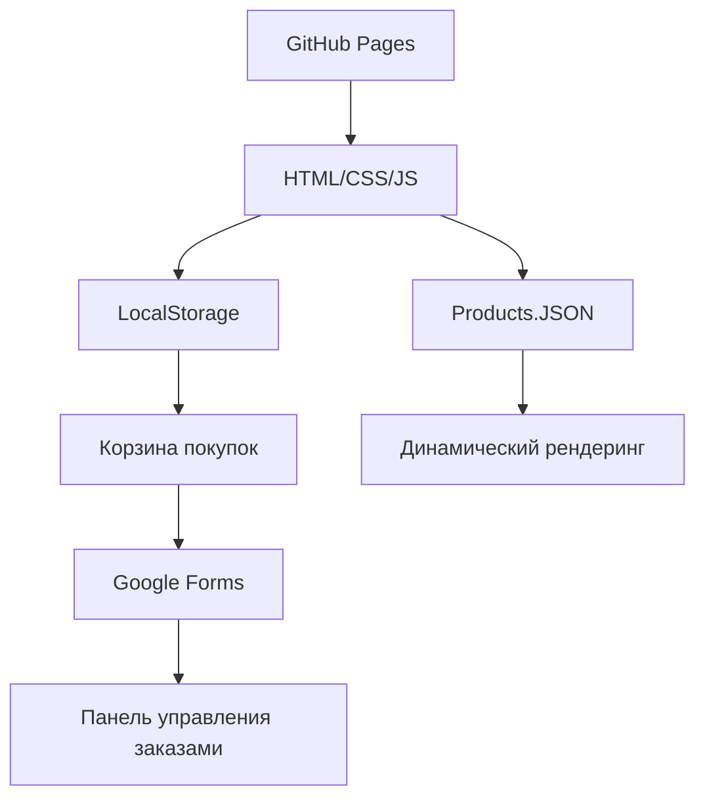

# Lazy Shop Framework

**Минималистичный фреймворк для создания интернет-магазинов на GitHub Pages**

## 🎯 Философия

Lazy Shop — это подход "ленивого разработчика": максимум результата при минимуме усилий. Мы верим, что создание интернет-магазина должно быть простым, быстрым и бесплатным.

> **"Лень — двигатель прогресса"** — мы автоматизируем рутину, чтобы вы могли сосредоточиться на самом важном: вашем бизнесе.

## ✨ Ключевые особенности

### 🚀 Нулевая стоимость
- **Бесплатный хостинг** на GitHub Pages
- **Никаких серверов** — полностью статический сайт
- **Отсутствие абонентской платы** — платите только за домен (если нужен)

### ⚡ Простота использования
- **Редактирование в одном файле** — весь каталог в `data/products.json`
- **Без программирования** — достаточно базового знания Excel/JSON
- **Интуитивное управление** — добавляйте товары как в таблице

### 🛡️ Надежность
- **Статические файлы** — нечего взламывать
- **Автоматическое резервное копирование** через Git
- **Высокая производительность** — мгновенная загрузка страниц

### 📱 Современные технологии
- **Адаптивный дизайн** — работает на всех устройствах
- **PWA-готовность** — можно установить как приложение
- **Быстрый поиск и фильтрация** на клиентской стороне

## 🏗️ Архитектура

### Технологический стек


### Структура данных
```json
{
  "id": 1,
  "name": "Название товара",
  "price": 10000,
  "images": ["url1.jpg", "url2.jpg"],
  "specs": {
    "width": 225,
    "height": 65,
    "diameter": 17
  }
}
```

## 🎨 Возможности кастомизации

### Темы оформления
- **Готовые CSS-темы** — быстрое изменение внешнего вида
- **Модульная структура** — легко修改 отдельные компоненты
- **CSS-переменные** — настройка цветов без редактирования кода

### Функциональность
- **Система фильтров** — по категориям, цене, брендам
- **Поиск товаров** — мгновенный поиск по названиям
- **Корзина покупок** — с сохранением в localStorage
- **Хлебные крошки** — удобная навигация
- **SEO-оптимизация** — готовые мета-теги и структура

## 📦 Что входит в комплект

### Базовые страницы
- 🏠 **Главная страница** — каталог товаров с фильтрами
- 📋 **Страница товара** — детальное описание и галерея
- 🛒 **Корзина** — управление заказом
- 📝 **Оформление заказа** — форма сбора данных
- ✅ **Подтверждение** — страница успешного заказа

### Инструменты разработчика
- 🛠️ **Конвертер Excel to JSON** — для импорта товаров
- 📊 **Генератор sitemap.xml** — для SEO
- 🤖 **Базовый robots.txt** — управление индексацией
- 📱 **PWA манифест** — для мобильных устройств

## 🚀 Быстрый старт

### 1. Клонируйте репозиторий
```bash
git clone https://github.com/yourname/lazy-shop.git
```

### 2. Настройте товары
Отредактируйте `data/products.json` под ваш каталог

### 3. Загрузите на GitHub
```bash
git add .
git commit -m "Мой первый магазин"
git push
```

### 4. Активируйте GitHub Pages
В настройках репозитория → Pages → branch: main

### 5. Profit!
Ваш магазин доступен по адресу `https://yourname.github.io/lazy-shop`

## 🛒 Система заказов

### Вариант 1: Google Forms (Рекомендуется)
- ✅ Полностью бесплатно
- ✅ Автоматическая таблица заказов
- ✅ Уведомления на email
- ✅ Простая настройка

### Вариант 2: Formspree/Getform
- ✅ REST API интеграция
- ✅ Валидация данных
- ✅ Спам-фильтры
- ✅ Бесплатный тариф

### Вариант 3: Telegram бот
- ✅ Мгновенные уведомления
- ✅ Удобство мобильного управления
- ✅ Простая реализация

## 🔧 Для разработчиков

### Расширение функциональности
```javascript
// Добавление собственных модулей
LazyShop.prototype.myCustomFeature = function() {
  // Ваш код здесь
};
```

### API данных
```javascript
// Доступ к товарам
const products = await LazyShop.loadProducts();
const filtered = LazyShop.filterProducts({ category: 'tires' });
```

### События системы
```javascript
// Подписка на события
document.addEventListener('lazyshop:cart-update', (event) => {
  console.log('Корзина обновлена:', event.detail);
});
```

## 📈 Для бизнеса

### Аналитика
- **Google Analytics** — готовые события конверсий
- **Yandex.Metrika** — цели и вебвизор
- **Facebook Pixel** — ретаргетинг и аудитории

### Маркетинг
- **SEO-структура** — оптимизированные заголовки и описания
- **Социальные мета-теги** — красивые превью в соцсетях
- **Open Graph** — максимальный охват

### Монетизация
- **Google AdSense** — готовые места для рекламы
- **Партнерские программы** — легкая интеграция
- **Email-маркетинг** — сбор подписчиков

## 🌟 Почему Lazy Shop?

### Для начинающих
- 🎯 **Без программирования** — достаточно редактировать JSON
- 📚 **Документация на русском** — понятные инструкции
- 👥 **Сообщество** — помощь и готовые решения

### Для разработчиков
- 🏗️ **Чистая архитектура** — легко расширять
- 🎨 **Модульная система** — заменяйте компоненты
- 🔧 **Modern JavaScript** — ES6+ и лучшие практики

### Для бизнеса
- 💰 **Нулевые затраты** на запуск
- ⚡ **Мгновенное развертывание** — 5 минут до работающего магазина
- 📊 **Готовность к росту** — масштабируемая структура

## 📝 Лицензия

MIT License — свободное использование, изменение и распространение.

## 🤝 Сообщество

- 📖 **Документация** — полное руководство на Wiki
- 💬 **Чат поддержки** — вопросы и ответы
- 🐛 **Баг-репорты** — помогайте улучшать框架
- 💡 **Идеи** — предлагайте новые функции

---

**Lazy Shop Framework** — потому что создание интернет-магазина должно быть простым и доступным для каждого.


Отличный запрос 👌
Если мы хотим, чтобы **Lazy Shop Framework** сразу чувствовался как полноценный проект на GitHub (с документацией, демкой и удобством для разработчика), то структура должна быть **минималистичной, но расширяемой**.

Я предлагаю вот такую структуру:

```
lazy-shop/
├── .github/
│   └── workflows/
│       └── deploy.yml          # Автодеплой на GitHub Pages
│
├── data/
│   └── products.json           # Каталог товаров (генерируется из Excel)
│
├── public/
│   ├── images/                 # Изображения товаров
│   ├── favicon.ico             # Иконка сайта
│   ├── manifest.json           # PWA-манифест
│   ├── robots.txt              # SEO-настройки
│   └── sitemap.xml             # Карта сайта
│
├── src/
│   ├── css/
│   │   ├── style.css           # Основные стили
│   │   └── themes/             # Темы оформления
│   │       ├── light.css
│   │       └── dark.css
│   │
│   ├── js/
│   │   ├── lazyshop.js         # Основное ядро Lazy Shop
│   │   ├── cart.js             # Логика корзины
│   │   ├── filters.js          # Фильтры и поиск
│   │   ├── ui.js               # Рендеринг интерфейса
│   │   └── plugins/            # Плагины расширений
│   │       └── example-plugin.js
│   │
│   ├── pages/                  # HTML-страницы (статические)
│   │   ├── index.html          # Главная (каталог)
│   │   ├── product.html        # Страница товара
│   │   ├── cart.html           # Корзина
│   │   ├── checkout.html       # Оформление заказа
│   │   └── success.html        # Успешный заказ
│   │
│   └── components/             # Повторно используемые куски
│       ├── header.html
│       ├── footer.html
│       └── product-card.html
│
├── tools/
│   ├── excel_to_json.py        # Конвертер Excel → JSON
│   ├── generate_sitemap.py     # Генератор sitemap.xml
│   └── optimize_images.py      # Скрипт оптимизации картинок
│
├── .gitignore
├── LICENSE                     # MIT License
├── README.md                   # Документация
└── package.json                # (опционально, если будут npm-скрипты)
```

---

### 📂 Пояснения по папкам

* **.github/workflows/**
  Настроим CI/CD: при пуше в main → автоматический билд/деплой на Pages.

* **data/**
  Только `products.json`. Всё управление магазином через этот файл.

* **public/**
  Всё, что идёт «как есть» на сайт: картинки, sitemap, robots.txt, PWA manifest.

* **src/**
  Это сердце фреймворка:

  * `css/` → стили и темы.
  * `js/` → модульная логика магазина.
  * `pages/` → основные HTML-шаблоны.
  * `components/` → переиспользуемые куски (header, footer, карточка товара).

* **tools/**
  Вспомогательные Python-скрипты (Excel → JSON, sitemap.xml, оптимизация картинок).

* **README.md**
  Краткий гайд по установке и запуску Lazy Shop.

* **package.json** *(опционально)*
  Если решим добавить npm-скрипты (например, `npm run build` для минификации CSS/JS или `npm run dev` для локального запуска).

---

⚡ Плюс: эту структуру можно легко развивать. Хочешь серверную версию → добавляешь `backend/`. Хочешь маркетплейс тем → расширяешь `src/css/themes/`.

---

👉 Хочешь, я соберу для тебя **skeleton-репозиторий** (пустые папки + базовые файлы с минимальным кодом), чтобы можно было сразу залить на GitHub и развернуть первую версию Lazy Shop?
